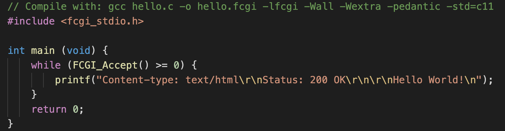

# Simple Docker

## Part 1. Готовый докер**
##### Взять официальный докер образ с **nginx** и выкачать его при помощи `docker pull`
##### Проверить наличие докер образа через `docker images`

##### Запустить докер образ через `docker run -d [image_id|repository]`
##### Проверить, что образ запустился через `docker ps`

##### Посмотреть информацию о контейнере через `docker inspect [container_id|container_name]`
##### По выводу команды определить и поместить в отчёт размер контейнера, список замапленных портов и ip контейнера

*By default, when you create or run a container using docker create or docker run, it does not publish any of its ports to the outside world. To make a port available to services outside of Docker, or to Docker containers which are not connected to the container’s network, use the --publish or -p flag. This creates a firewall rule which maps a container port to a port on the Docker host to the outside world.*
##### Остановить докер образ через `docker stop [container_id|container_name]`
##### Проверить, что образ остановился через `docker ps`

##### Запустить докер с замапленными портами 80 и 443 на локальную машину через команду *run*
##### Проверить, что в браузере по адресу *localhost:80* доступна стартовая страница **nginx**

##### Перезапустить докер образ через `docker restart [image_id|repository]`
##### Проверить любым способом, что контейнер запустился

## Part 2. Операции с контейнером
##### Прочитать конфигурационный файл *nginx.conf* внутри докер образа через команду *exec*

##### Создать на локальной машине файл *nginx.conf*
##### Настроить в нем по пути */status* отдачу страницы статуса сервера **nginx**
##### Скопировать созданный файл *nginx.conf* внутрь докер образа через команду `docker cp`
##### Перезапустить **nginx** внутри докер образа через команду *exec*

##### Проверить, что по адресу *localhost:80/status* отдается страничка со статусом сервера **nginx**

##### Экспортировать контейнер в файл *container.tar* через команду *export*
##### Остановить контейнер

##### Удалить образ через `docker rmi [image_id|repository]`, не удаляя перед этим контейнеры

##### Импортировать контейнер обратно через команду *import*
##### Запустить импортированный контейнер

## Part 3. Мини веб-сервер

##### Написать мини сервер на **C** и **FastCgi**, который будет возвращать простейшую страничку с надписью `Hello World!`

##### Запустить написанный мини сервер через *spawn-cgi* на порту 8080
##### Написать свой *nginx.conf*, который будет проксировать все запросы с 81 порта на *127.0.0.1:8080*

##### Проверить, что в браузере по *localhost:81* отдается написанная вами страничка

##### Положить файл *nginx.conf* по пути *./nginx/nginx.conf* (это понадобиться позже)

## Part 4. Свой докер
#### Написать свой докер образ, который:
##### 1) собирает исходники мини сервера на FastCgi из [Части 3](#part-3-мини-веб-сервер)
##### 2) запускает его на 8080 порту
##### 3) копирует внутрь образа написанный *./nginx/nginx.conf*
##### 4) запускает **nginx**.
##### Собрать написанный докер образ через `docker build` при этом указав имя и тег

##### Проверить через `docker images`, что все собралось корректно

##### Запустить собранный докер образ с маппингом 81 порта на 80 на локальной машине и маппингом папки *./nginx* внутрь контейнера по адресу, где лежат конфигурационные файлы **nginx**'а (см. [Часть 2](#part-2-операции-с-контейнером))

##### Проверить, что по localhost:80 доступна страничка написанного мини сервера

##### Дописать в *./nginx/nginx.conf* проксирование странички */status*, по которой надо отдавать статус сервера **nginx**

##### Перезапустить докер образ
*Если всё сделано верно, то, после сохранения файла и перезапуска контейнера, конфигурационный файл внутри докер образа должен обновиться самостоятельно без лишних действий*
##### Проверить, что теперь по *localhost:80/status* отдается страничка со статусом **nginx**

## Part 5. **Dockle**

##### Просканировать контейнер из предыдущего задания через `dockle [container_id|container_name]`

##### Исправить контейнер так, чтобы при проверке через **dockle** не было ошибок и предупреждений

## Part 6. Базовый **Docker Compose**

Вот вы и закончили вашу разминку. А хотя погодите...
Почему бы не поэкспериментировать с развёртыванием проекта, состоящего сразу из нескольких докер образов?

**== Задание ==**

##### Написать файл *docker-compose.yml*, с помощью которого:
##### 1) Поднять докер контейнер из [Части 5](#part-5-инструмент-dockle) _(он должен работать в локальной сети, т.е. не нужно использовать инструкцию **EXPOSE** и мапить порты на локальную машину)_
##### 2) Поднять докер контейнер с **nginx**, который будет проксировать все запросы с 8080 порта на 81 порт первого контейнера
##### Замапить 8080 порт второго контейнера на 80 порт локальной машины

##### Остановить все запущенные контейнеры
##### Собрать и запустить проект с помощью команд `docker-compose build` и `docker-compose up`
##### Проверить, что в браузере по *localhost:80* отдается написанная вами страничка, как и ранее