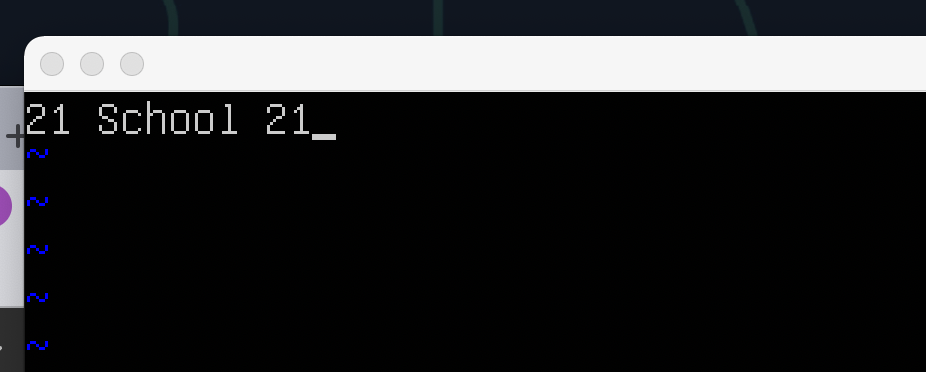

# UNIX/Linux operating systems (Basic)

## 1. Установка ОС
- импортировал образ Ubuntu server из папки shared в goinfree
- запустил с исходными настройками
- логин, пароль для входа: student, student
- для проверки версии системы запустил команду:

## 2. Создание пользователя
- запустил adduser cangelen
- установил пароль, оставил поля информации о пользователе пустыми
- c помощью команды usermod -aG sudo cangelen добавил пользователя в группу sudo
- для проверки создания нового пользователя запустил команду:

## 3. Настройка сети ОС

- Изменил название машины:
    - sudo nano /etc/hostname: заменил исходное название на имя пользователя
    - sudo nano /etc/hosts: заменил исходные названия на имя пользователя
    - сделал sudo reboot

- Установил временную зону:
    - timedatectl list-timezones: вывел список временных зон
    - sudo timedatectl set-timezone Asia/Novosibirsk: установил новую зону
    - timedatectl: проверил обновленную временную зону

- Вывел названия сетевых интерфейсов:
    - запустил команду ip link show
    - lo – аббревиатура для Loopback interface. В этом интерфейсе любой трафик, исходящий из компьютера, адресуется тому же компьютеру. Этот интерфейс используется для идентификации устройства, поскольку его адрес никогда не меняется

- Получил ip адрес устройства:
    - curl ifconfig.me: публичный адрес
    - ifconfig -a: частный адрес
    - Аббревиатура DHCP расшифровывается, как Dynamic Host Configuration Protocol. Этот протокол используется для автоматической настройки компьютера, подключаемого к сети TCP/IP

- Вывел на экран внешний и внутренний IP-адрес шлюза:
    

- Задал статичные настройки ip, gw, dns - 1.1.1.1:
    - sudo nano /etc/netplan/00-installer-config.yaml
    

- Сделал перезапуск: 
    - sudo reboot

- Результаты ping:

    - ping 1.1.1.1
    

    - ping ya.ru
    

## 4. Обновление ОС

- Запустил:
- sudo apt update
- sudo apt upgrade

    

## 5. Использование команды sudo

- sudo расшифровывается как substitute user and do. Она позволяет выполнять любые команды от имени root или от других пользователей

## 6. Установка и настройка службы времени

- Служба синхронизации времени активна:

## 7. Установка и использование текстовых редакторов

- В трех файлах разными редакторами записан никнейм. Команды для сохранения vim: :wq, nano: ctrl x, Y, mcedit: 2 || esc + save

- Редактирую без сохранения изменений в vim. Команда :q! :

- Редактирую без сохранения изменений в nano. Команда ctr x, no save:

- Редактирую без сохранения изменений в mcedit. Команда esc, no save:

- Заменил в каждом файле с помощью разных редакторов никнейм на первую строку из Raven, далее заменил I на сangelen:

## 8. Установка и базовая настройка сервиса SSHD

- Служба установлена. Добавил в автозагрузку и сделал reboot:

- Проверка состояния службы после перезапуска:

 

 - Перенастроил порт:

 

  - Определил process identifier и запустил ps:

 
 - ps выводит список текущих процессов на сервере:
    - PID  - идентификатор процесса
    - TTY - тип терминала, в котором находится пользователь(подсистема для использования одного терминала несколькими процессами)
    - STAT - S: процесс ожидает, s: лидер сессии
    - TIME - время ЦП в минутах и секундах, затраченное на обработку процесса
    - COMMAND - название команды, которая запускает процесс

  - Запуск netstat -tan после перезагрузки:

 
- Netstat служит для отображения состояния сетевого интерфейса TCP/IP

    - Использованные опции:
        - флаг -t отображает порты семейства tcp (transmission control protocol)
        - флаг -a отображает состояние всех портов
        - флаг -n отображает адреса сети в виде чисел

    - Описание вывода:
        - Proto - название протокола
        - Recv-Q - размер очередей приема
        - Send-Q - размер очередей отправки
        - Local Address - локальный адрес
        - Foreign Address - удаленный адрес
        - State - состояние порта(LISTEN - ожидает входящих соединений)

    - 0.0.0.0 обозначает, что порт ожидает входящих соединений на всех сетевых интерфейсах
    

## 9. Установка и использование утилит top, htop

- Вывод команды top:
 
 - Описание:
    - uptime: 45 минут 48 секунд
    - количество авторизованных пользователей: 1
    - общая загрузка системы за 1, 5, 15 минут: 0.07, 0, 0.13, 0.09
    - общее количество процессов: 106
    - загрузка cpu: 0.3
    - загрузка памяти: 197.9 mb
    - pid процесса занимающего больше всего памяти: 1
    - pid процесса, занимающего больше всего процессорного времени: 1265, 1292

- Вывод команды htop:
 - отсортирован по PID, PERCENT_CPU, PERSENT_MEM, TIME
 

  - отфильтрован для процесса sshd
 

  - с найденным syslog
 

   - с добавленным выводом hostname, clock и uptime
 

 ## 10. Использование утилиты fdisk

 - Вывод команды:

- Описание:
    - название: VBOX HARDDISK
    - размер: 16 GB, 33554432 с секторов

 - Размер swap 16 MB:

 ## 11. Использование утилиты df

- Вывод df(disk free):

- Описание /:
 - размер раздела: 16445308
 - размер занятого пространства: 5718860
 - размер свободного пространства: 9871360
 - процент использования: 37
 - Единица измерения: 1024-байтовые блоки

 - Вывод df -Th(тип для каждой файловой системы и удобные ед измерения):

- Описание /:
 - размер раздела: 16G
 - размер занятого пространства: 5.5G
 - размер свободного пространства: 9.5G
 - процент использования: 37
 - Тип файловой системы: ext4

 ## 12. Использование утилиты du

- Запуск команды du:

- Вывод размеров папок /home, /var, /var/log:

- Вывод размеров всего содержимого в /var/log/*:

 ## 13. Установка и использование утилиты ncdu

- Вывод для /home:

- Вывод для /var:

- Вывод для /var/log:

 ## 14. Работа с системными журналами

 - Скриншот из auth.log:
 

 - После запуска systemctl restart ssh и перезагрузки:
 

 ## 15. Использование планировщика заданий CRON

  - Запуск uptime через каждые 2 минуты:
 

 - Список текущих заданий:
 

- Удаление заданий:
