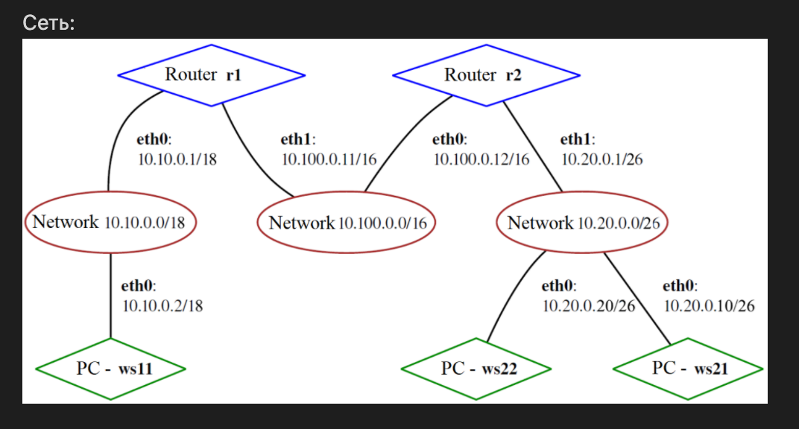
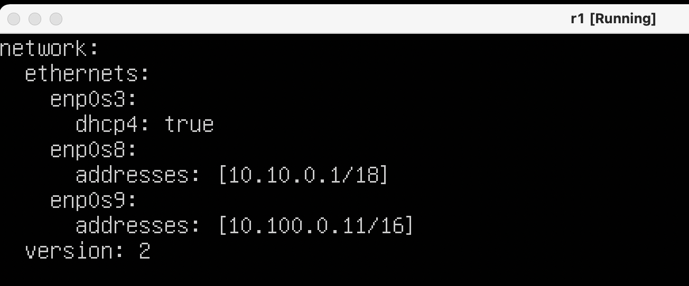
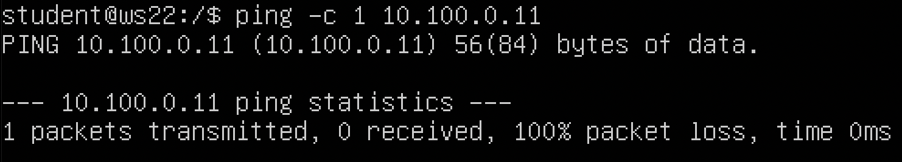

# Настройка сетей в Linux на виртуальных машинах

## Part 1. Инструмент **ipcalc**
### 1.1. Сети и маски
##### 1) Адрес сети *192.167.38.54/13*: 

##### 2) Перевод маски *255.255.255.0* в префиксную(Classless Inter-Domain Routing) и двоичную запись:

##### */15* в обычную и двоичную: 

##### *11111111.11111111.11111111.11110000* в обычную и префиксную:

##### 3) Минимальный и максимальный хост в сети *12.167.38.4* при маске */8*:

##### маске *11111111.11111111.00000000.00000000*:

##### маске *255.255.254.0*:

##### маске */4*:

#### 1.2. localhost
##### Localhost - доменное имя для адреса 127.0.0.1. Можно обратиться к приложению, работающему в интервале от 127.0.0.1 до 127.0.0.254:

#### Следовательно:
##### *194.34.23.100/16* - НЕТ;
##### *127.0.0.2/24* - ДА;
##### *127.1.0.1/8* - ДА;
##### *128.0.0.1/8* - НЕТ.
#### 1.3. Диапазоны и сегменты сетей
##### 1)По стандарту RFC 1918, IANA частными могут быть адреса в следующих диапазонах: 

##### следовательно, частные: *10.0.0.45/8*, *192.168.4.2/16*, *172.20.250.4/12*, *172.16.255.255/12*, *10.10.10.10/8*
##### публичные: *134.43.0.2/16*, *172.0.2.1/12*, *192.172.0.1/12*, *172.68.0.2/12*, *192.169.168.1/16*
##### 2) У сети *10.10.0.0/18* возможны адреса шлюза от 10.10.0.1 до 10.10.63.254: 

#### Следовательно могут быть *10.0.0.1*, *10.10.0.2*, *10.10.10.10*

## Part 2. Статическая маршрутизация между двумя машинами
##### Поднять две виртуальные машины (далее -- ws1 и ws2)
##### С помощью команды `ip a` посмотреть существующие сетевые интерфейсы:

##### Описать сетевой интерфейс, соответствующий внутренней сети, на обеих машинах:
1. UP - интерфейс активен и обеспечивает соединение
2. LOWER_UP - кабель подключен и устройство соединено с сетью (физический уровень)
3. mtu - (maximum transmission unit) максимальный размер полезного блока данных одного пакета, который может быть передан атомарно
4. qdisc - queueing discipline, дисциплина очередности. Всякий раз, когда ядру требуется отправить пакет на интерфейс, он ставится в очередь к qdisc. fq_codel - планировщик с активным управлением очередью, те отбрасывает пакет в случе затора
5. Адрес интерфейса: 127.0.0.1/8
##### Задать следующие адреса и маски: ws1 - *192.168.100.10*, маска */16*, ws2 - *172.24.116.8*, маска */12*

##### Выполнить команду `netplan apply` для перезапуска сервиса сети

#### 2.1. Добавление статического маршрута вручную
##### Добавить статический маршрут от одной машины до другой и обратно при помощи команды вида `ip r add`
##### Пропинговать соединение между машинами

#### 2.2. Добавление статического маршрута с сохранением
##### Перезапустить машины
##### Добавить статический маршрут от одной машины до другой с помощью файла *etc/netplan/00-installer-config.yaml*

##### Пропинговать соединение между машинами

## Part 3. Утилита **iperf3**
*Обновил ws1 и ws2, установил iperf3*

#### 3.1. Скорость соединения: 
1. **8 Mbps = 1 MB/s**
2. **100 MB/s = 800000 Kbps**
3. **1 Gbps = 1000 Mbps**

#### 3.2. Утилита **iperf3**
##### Измерить скорость соединения между ws1 и ws2

## Part 4. Сетевой экран

#### 4.1. Утилита **iptables**

#### Комментарии к правилам:
*Правила выполняются последовательно сверху вниз. Новые правила для каждого вида пакетов (input, output, forward) можно добавлять в конец цепочки (A - append), вставлять под номером n(I - insert) или заменять правило под номером n (R - replace). В данном случае последнее из правил Output будет находиться в статусе unreacheable. Ожидаем, что ws1 не ответит на запроc ws2, а пинг от ws1 к ws2 будет успешным*

#### 4.2. Утилита **nmap**
##### Командой **ping** найти машину, которая не "пингуется", после чего утилитой **nmap** показать, что хост машины запущен
*Проверка: в выводе nmap должно быть сказано: `Host is up`*

##### Сохранить дампы образов виртуальных машин
1. Запустил apport
2. Изменил размер дамп файла, по умолчанию 0
3. Сделал дамп sleep 30 | ctr + \

## Part 5. Статическая маршрутизация сети
#### 5.1. Настройка адресов машин
##### Настроить конфигурации машин в *etc/netplan/00-installer-config.yaml* согласно сети на рисунке.

##### Перезапустить сервис сети. Если ошибок нет, то командой `ip -4 a` проверить, что адрес машины задан верно. 

##### Также пропинговать ws22 с ws21. 

##### Аналогично пропинговать r1 с ws11.

#### 5.2. Включение переадресации IP-адресов.
##### Для включения переадресации IP, выполните команду на роутерах:
`sysctl -w net.ipv4.ip_forward=1`
*При таком подходе переадресация не будет работать после перезагрузки системы.*

##### Откройте файл */etc/sysctl.conf* и добавьте в него следующую строку:
`net.ipv4.ip_forward = 1`
*При использовании этого подхода, IP-переадресация включена на постоянной основе.*

#### 5.3. Установка маршрута по-умолчанию
##### Настроить маршрут по-умолчанию (шлюз) для рабочих станций. Для этого добавить gateway4 \[ip роутера\] в файле конфигураций
##### Вызвать `ip r` и показать, что добавился маршрут в таблицу маршрутизации

##### Пропинговать с ws11 роутер r2 и показать на r2, что пинг доходит. Для этого использовать команду:
`tcpdump -tn -i eth1`

**NB: Именения настроек сети: новые адаптеры роутеров и рабочих станций в режиме Internal network**

#### 5.4. Добавление статических маршрутов
##### Добавить в роутеры r1 и r2 статические маршруты в файле конфигураций. 
**NB: Ошибка в описании. Необходимо прописывать маски для путей**

##### Вызвать `ip r` и показать таблицы с маршрутами на обоих роутерах. Пример таблицы на r1:

##### Запустить команды на ws11:
`ip r list 10.10.0.0/[маска сети]` и `ip r list 0.0.0.0/0`

- В отчёте объяснить, почему для адреса 10.10.0.0/\[порт сети\] был выбран маршрут, отличный от 0.0.0.0/0, хотя он попадает под маршрут по-умолчанию.
 **В разделе 5.3 для ws11 мы указали шлюз, находящийся во внутренней сети 10.10.0.0/18. Для адреса 0.0.0.0/0 маршрутов написано не было.**

#### 5.5. Построение списка маршрутизаторов
##### Запустить на r1 команду дампа:

##### При помощи утилиты **traceroute** построить список маршрутизаторов на пути от ws11 до ws21

**Описание маршрута:**
1. Передача на шлюз, соответсвующий интерфейсу enp0s8 роутера r1
2. Через широковещательный адрес на интерфейс enp0s8 роутера r2
3. Роутер r2 переадресовывает передачу пакета с одного своего интерфейса на другой, чтобы выйти в сеть 10.20.0.0, где находися ws21

#### 5.6. Использование протокола **ICMP** при маршрутизации
##### Запустить на r1 перехват сетевого трафика, проходящего через eth0 с помощью команды:
##### Пропинговать с ws11 несуществующий IP (например, *10.30.0.111*) с помощью команды:

## Part 6. Динамическая настройка IP с помощью **DHCP**

##### Указать MAC адрес у ws11, для этого в *etc/netplan/00-installer-config.yaml* надо добавить строки: `macaddress: 10:10:10:10:10:BA`, `dhcp4: true`

##### Для r2 настроить в файле */etc/dhcp/dhcpd.conf* конфигурацию службы **DHCP**:
##### 1) указать адрес маршрутизатора по-умолчанию, DNS-сервер и адрес внутренней сети. Пример файла для r2:
**NB: Пример указан для маски 18, что не соответсвует сети 10.20.0.0/26**

##### 2) в файле *resolv.conf* прописать `nameserver 8.8.8.8.`

##### Перезагрузить службу **DHCP** командой `systemctl restart isc-dhcp-server`.

#### Машину ws21 перезагрузить при помощи `reboot` и через `ip a` показать, что она получила адрес.

#### Также пропинговать ws22 с ws21.

##### Для r1 настроить аналогично, но сделать выдачу адресов с жесткой привязкой к MAC-адресу (ws11). 

##### Провести аналогичные тесты

##### Запросить с ws21 обновление ip адреса
**Исходный адрес**

**Удаление клиента опцией r и повторный запуск**

**MAC-адрес (от англ. Media Access Control — надзор за доступом к среде, также Hardware Address, также физический адрес) — уникальный идентификатор, присваиваемый каждой единице активного оборудования или некоторым их интерфейсам в компьютерных сетях Ethernet**
 
**Адрес 8.8.8.8 - один из Google Public DNS. Интернет-сервис корпорации Google, предоставляющий общедоступные DNS-серверы.**

## Part 7. **NAT**
*В данном задании используются виртуальные машины из Части 5*
##### В файле */etc/apache2/ports.conf* на ws22 и r2 изменить строку `Listen 80` на `Listen 0.0.0.0:80`, то есть сделать сервер Apache2 общедоступным

##### Запустить веб-сервер Apache командой `service apache2 start` на ws22 и r1

##### Добавить в фаервол, созданный по аналогии с фаерволом из Части 4, на r2 следующие правила:
##### 1) Удаление правил в таблице filter - `iptables -F`
##### 2) Удаление правил в таблице "NAT" - `iptables -F -t nat`
##### 3) Отбрасывать все маршрутизируемые пакеты - `iptables --policy FORWARD DROP`
##### Запускать файл также, как в Части 4

##### Проверить соединение между ws22 и r1 командой `ping`

##### Добавить в файл ещё одно правило:
##### 4) Разрешить маршрутизацию всех пакетов протокола **ICMP**
##### Запускать файл также, как в Части 4

##### Проверить соединение между ws22 и r1 командой `ping`
*При запуске файла с этими правилами, ws22 должна "пинговаться" с r1*

##### Добавить в файл ещё два правила:
##### 5) Включить **SNAT**, а именно маскирование всех локальных ip из локальной сети, находящейся за r2 (по обозначениям из Части 5 - сеть 10.20.0.0)
*Совет: стоит подумать о маршрутизации внутренних пакетов, а также внешних пакетов с установленным соединением*
##### 6) Включить **DNAT** на 8080 порт машины r2 и добавить к веб-серверу Apache, запущенному на ws22, доступ извне сети
*Совет: стоит учесть, что при попытке подключения возникнет новое tcp-соединение, предназначенное ws22 и 80 порту*

##### Запускать файл также, как в Части 4
*Перед тестированием рекомендуется отключить сетевой интерфейс **NAT** (его наличие можно проверить командой `ip a`) в VirtualBox, если он включен*
##### Проверить соединение по TCP для **SNAT**, для этого с ws22 подключиться к серверу Apache на r1 командой:
`telnet [адрес] [порт]`

##### Проверить соединение по TCP для **DNAT**, для этого с r1 подключиться к серверу Apache на ws22 командой `telnet` (обращаться по адресу r2 и порту 8080)

## Part 8. Дополнительно. Знакомство с **SSH Tunnels**
##### Запустить веб-сервер **Apache** на ws22 только на localhost (то есть не изменять файл */etc/apache2/ports.conf* или, если был изменен ранее, вернуть строку `Listen 80`)

##### Воспользоваться *Local TCP forwarding* с ws21 до ws22, чтобы получить доступ к веб-серверу на ws22 с ws21

##### Воспользоваться *Remote TCP forwarding* c ws11 до ws22, чтобы получить доступ к веб-серверу на ws22 с ws11

`telnet 127.0.0.1 [локальный порт]`

