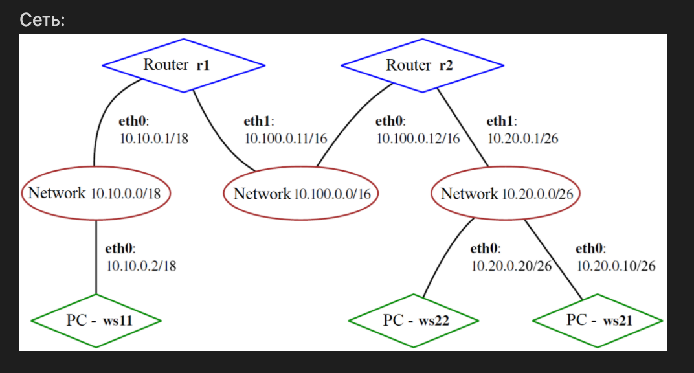

# DevOps projects from school 21
1. [Linux setup](#linux-setup)
2. [Networking](#networking)
3. [Monitoring 1](#monitoring-1)
4. [Monitoring 2](#monitoring-2)
5. [Docker](#docker)
4. [CI/CD](#cicd)

## Linux setup

This is an introduction to Virtual Machines with Oracle VB. As of today, I have experience with VMWare and Proxmox.
Here I imported ubuntu server 20.04 from vdi in Virtual Box, set up the system(user, network, time service, sshd), practiced with text editors(vi, nano, mcedit), monitoring utils(fdisk, df, du, ncdu,  ps, top, htop) and cron.

All parts are described in detail: https://github.com/ATiagunov/DevOps/blob/79a545f74e5ab2e5471fc6866701300efd65474c/Linux%20setup/linux.md

## Networking

In this project I learned basic networking concepts and build static network according to scheme:
  

## Monitoring 1

## Monitoring 2

## Docker

## CI/CD
### 1. Setting up the gitlab-runner
Gitlab-runner is installed on ubuntu server and linked with the repository
### 2. Building
All stages are tested on my cat/grep project, where I implemented these utils in C.
I copied source files to the gitlab repository and created a stage to build an application with saving artifacts for 30 days.
### 3. Testing
Then I added stages to run codestyle and integration tests.
### 4. Deployment
The deployment on another ubuntu virtual machine is done via scp and script that extracts archive to protected directory on remote machine.
The approach is unsafe due to open ssh connection as root on deployment machine and copied ssh-id.
### 6. Telegram bot notifier
I created telegram bot that notifies me about pipeline results.
